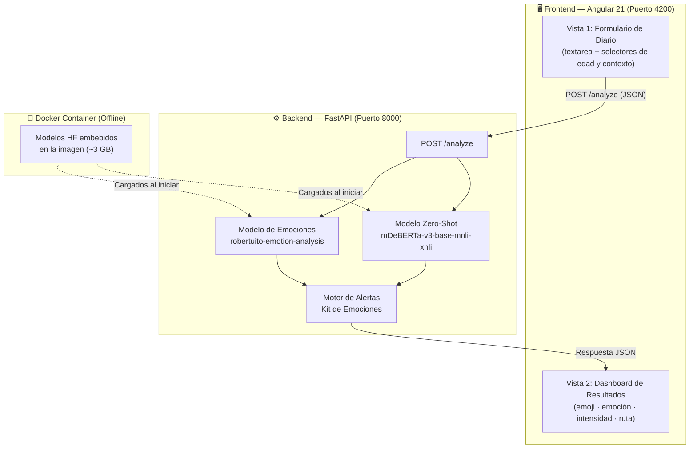

# 🧠 Diario Emocional — Plataforma de Análisis Emocional con IA

> **Versión 2.0** · Kit de Emociones · Plataforma Educativa

Un microservicio de Inteligencia Artificial que analiza textos de un "Diario Emocional" escolar para detectar emociones, evaluar riesgos psicológicos y asignar rutas de acompañamiento personalizadas, consumido por una interfaz Angular moderna y empática.

---

## 📋 Tabla de Contenidos

1. [¿Qué resuelve este proyecto?](#-qué-resuelve-este-proyecto)
2. [Arquitectura y Tecnologías](#-arquitectura-y-tecnologías)
3. [Características Principales](#-características-principales)
4. [Estructura del Proyecto](#-estructura-del-proyecto)
5. [Guía de Instalación y Ejecución](#-guía-de-instalación-y-ejecución)
6. [Referencia de la API](#-referencia-de-la-api)
7. [Consideraciones Técnicas](#-consideraciones-técnicas)

---

## 🎯 ¿Qué resuelve este proyecto?

En entornos educativos, detectar a tiempo señales de malestar emocional, acoso o riesgo psicológico en estudiantes es un desafío crítico. Este proyecto proporciona una herramienta digital que:

- **Analiza** textos libres escritos por estudiantes en un diario emocional.
- **Detecta** la emoción predominante usando modelos de IA pre-entrenados en español.
- **Evalúa** indicadores de riesgo psicológico y escolar (acoso, ciberacoso, depresión, ideación suicida, etc.) mediante clasificación zero-shot.
- **Asigna** una ruta de acompañamiento pedagógica (Verde / Ámbar / Rojo) con recomendaciones concretas y adaptadas por edad.
- **Opera** completamente offline — sin dependencias de APIs externas en tiempo de ejecución.

---

## 🏗️ Arquitectura y Tecnologías

### Diagrama de Arquitectura



### Stack Tecnológico

| Capa | Tecnología | Versión | Propósito |
|---|---|---|---|
| **Backend** | Python | 3.11 | Lenguaje principal |
| | FastAPI | ≥0.115 | Framework web / API REST |
| | Uvicorn | ≥0.30 | Servidor ASGI |
| | Transformers | ≥4.44 | Librería de modelos HF |
| | PyTorch | CPU-only | Runtime de inferencia |
| | mDeBERTa-v3 | base-mnli-xnli | Zero-shot classification |
| | RoBERTuito | emotion-analysis | Clasificación de emociones ES |
| **Frontend** | Angular | 21 | Framework SPA |
| | TypeScript | 5.x | Tipado fuerte |
| | CSS Vanilla | — | Glassmorphism · Animaciones |
| **Infra** | Docker | — | Contenerización |
| | Docker Compose | — | Orquestación local |

---

## ✨ Características Principales

### 🤖 IA Offline — Sin dependencias externas en runtime
Los modelos de Hugging Face se descargan durante el `docker build` y quedan **embebidos en la imagen**. Una vez construida, el contenedor analiza textos sin necesidad de conexión a internet.

### 🌍 8 Emociones Núcleo en Español
Basado en la rueda de Plutchik, los postulados de Goleman y los lineamientos de la OMS:

| Etiqueta del Modelo | Emoción en Español | Emoji | Categoría |
|---|---|---|---|
| joy | Alegría | 😊 | positiva |
| sadness | Tristeza | 😢 | negativa |
| fear | Miedo | 😰 | negativa |
| anger | Ira | 😠 | negativa |
| disgust | Desgano / Desmotivación | 😞 | negativa |
| surprise | Sorpresa | 😲 | neutra |
| others | Neutral | 😐 | neutra |

### 📊 3 Niveles de Intensidad

| Nivel | Rango del Score | Emoji |
|---|---|---|
| Leve | score < 0.40 | 🌱 |
| Moderado | 0.40 ≤ score < 0.70 | ⚡ |
| Intenso | score ≥ 0.70 | 🔥 |

### 🛤️ 3 Rutas de Acompañamiento (Kit de Emociones)

| Nivel de Alerta | Ruta | Acción |
|---|---|---|
| 🟢 **Verde** | Refuerzo positivo | Sin intervención — mensajes motivacionales |
| 🟡 **Ámbar** | Actividades de bienestar | Seguimiento sugerido — respiración, escritura, actividades |
| 🔴 **Rojo** | Alerta a orientador escolar | Intervención inmediata — notificación al psicólogo/orientador |

### 🎮 Gamificación y Refuerzo Positivo
Cuando la emoción dominante es positiva, la API devuelve mensajes de refuerzo motivacional que el frontend muestra en un banner dorado animado.

### 🏫 Detección de Riesgos Escolares
El pipeline zero-shot evalúa 10 etiquetas de riesgo, incluyendo 4 específicas del contexto escolar:

- `acoso escolar` · `ciberacoso` · `exclusión social` · `violencia`
- `depresión` · `ansiedad` · `ideación suicida` · `autolesión`

---

## 📁 Estructura del Proyecto

```
emocionales/
│
├── 📄 main.py                  ← API FastAPI v2.0 (endpoints + lógica de alertas)
├── 📄 preload_models.py        ← Script de pre-descarga de modelos HF
├── 📄 requirements.txt         ← Dependencias Python (sin PyTorch)
├── 🐳 Dockerfile               ← Imagen multi-capa con modelos embebidos
├── 🐳 docker-compose.yml       ← Orquestación (expone puerto 8000)
├── 📄 .dockerignore
├── 📖 README.md                ← Esta documentación
│
└── 📁 frontend/                ← Aplicación Angular 21
    └── src/
        ├── index.html          ← HTML base (lang="es", meta description)
        ├── styles.css          ← Estilos globales (Inter font, scrollbar)
        └── app/
            ├── app.ts          ← Componente principal + ChangeDetectorRef
            ├── app.html        ← Template: formulario + dashboard
            ├── app.css         ← Glassmorphism, animaciones, alertas
            ├── app.config.ts   ← provideZonelessChangeDetection + HttpClient
            ├── models/
            │   └── emotion.models.ts  ← Interfaces TypeScript (AnalysisResponse, etc.)
            └── services/
                └── emotion.service.ts ← Servicio HTTP (POST /analyze)
```

---

## 🚀 Guía de Instalación y Ejecución

### Requisitos Previos

- [Docker Desktop](https://www.docker.com/products/docker-desktop/) instalado y corriendo.
- [Node.js](https://nodejs.org/) v18+ y npm instalados.
- ~4 GB de espacio en disco libre (imagen Docker con modelos de IA).

---

### 1. Backend — Microservicio de IA

```bash
# Clonar o entrar a la carpeta del proyecto
cd emocionales

# Construir la imagen y levantar el contenedor
# ⚠️ La primera vez puede tardar 10-20 minutos (descarga modelos ~800 MB)
docker-compose up --build
```

Cuando veas esto en la terminal, el servicio está listo:

```
diario-emocional-api  | ✅ Emociones: pysentimiento/robertuito-emotion-analysis
diario-emocional-api  | ✅ Zero-shot: MoritzLaurer/mDeBERTa-v3-base-mnli-xnli
diario-emocional-api  | 🚀 Servicio listo.
diario-emocional-api  | INFO: Application startup complete.
```

> **URLs disponibles:**
> - API base: `http://localhost:8000`
> - Documentación Swagger interactiva: `http://localhost:8000/docs`
> - Health check: `http://localhost:8000/health`
> - Catálogo de emociones: `http://localhost:8000/emotions`

---

### 2. Frontend — Aplicación Angular

```bash
# Entrar a la carpeta del frontend
cd emocionales/frontend

# Instalar dependencias (solo la primera vez)
npm install

# Levantar el servidor de desarrollo
npm start
```

La aplicación estará disponible en: **`http://localhost:4200`**

> **Nota:** El frontend hace llamadas directamente a `http://localhost:8000`. Asegúrate de que el backend esté corriendo antes de usar la aplicación.

---

## 📡 Referencia de la API

### `POST /analyze` — Analizar texto emocional

#### Request

```http
POST http://localhost:8000/analyze
Content-Type: application/json
```

```json
{
  "text": "Hoy nadie me habló en el recreo y me sentí completamente solo.",
  "student_age_range": "10-13",
  "context": "diario"
}
```

| Campo | Tipo | Requerido | Descripción |
|---|---|---|---|
| `text` | `string` | ✅ Sí | Texto del diario (3–5000 caracteres) |
| `student_age_range` | `string \| null` | ❌ Opcional | Rango de edad: `"6-9"`, `"10-13"`, `"14-17"` |
| `context` | `string \| null` | ❌ Opcional | Contexto: `"diario"`, `"check-in"`, `"actividad"` |

#### Response `200 OK`

```json
{
  "text": "Hoy nadie me habló en el recreo y me sentí completamente solo.",
  "timestamp": "2026-04-23T17:00:00.000Z",
  "context": "diario",
  "student_age_range": "10-13",

  "dominant_emotion": {
    "label_en": "sadness",
    "label_es": "Tristeza",
    "emoji": "😢",
    "category": "negativa",
    "score": 0.8712
  },

  "intensity": {
    "level": "Intenso",
    "emoji": "🔥",
    "value": 3
  },

  "all_emotions": [
    { "label_en": "sadness", "label_es": "Tristeza", "emoji": "😢", "category": "negativa", "score": 0.8712 },
    { "label_en": "fear",    "label_es": "Miedo",    "emoji": "😰", "category": "negativa", "score": 0.0612 },
    { "label_en": "others",  "label_es": "Neutral",  "emoji": "😐", "category": "neutra",   "score": 0.0389 }
  ],

  "risk_analysis": [
    { "label": "exclusión social", "score": 0.7423, "is_school_related": true  },
    { "label": "depresión",        "score": 0.6102, "is_school_related": false },
    { "label": "acoso escolar",    "score": 0.4210, "is_school_related": true  },
    { "label": "ansiedad",         "score": 0.3801, "is_school_related": false },
    { "label": "bienestar",        "score": 0.0534, "is_school_related": false }
  ],

  "alert_level": "Rojo",
  "alert_emoji": "🔴",
  "alert_description": "Se detecta una emoción intensa de 'Tristeza' combinada con indicadores de riesgo significativos.",

  "route": {
    "name": "Alerta a orientador escolar — Seguimiento prioritario",
    "requires_follow_up": true
  },

  "recommendations": [
    "🚨 Notificar al orientador/psicólogo escolar.",
    "Considera hablar con un profesional de salud mental.",
    "⚠️ Se detectaron señales de: exclusión social, acoso escolar.",
    "Reportar al comité de convivencia escolar para investigación.",
    "👨‍👩‍👧 Comparte lo que sientes con tu familia o tu profesor/a de confianza."
  ],

  "positive_reinforcement": []
}
```

---

### Otros Endpoints

| Método | Ruta | Descripción |
|---|---|---|
| `GET` | `/` | Información general del servicio y versión |
| `GET` | `/health` | Estado de salud + modelos cargados |
| `GET` | `/docs` | Swagger UI — Documentación interactiva |
| `GET` | `/emotions` | Catálogo: 8 emociones, 3 intensidades, 3 niveles de alerta |

---

### Ejemplo con `curl` (PowerShell)

```powershell
curl -X POST http://localhost:8000/analyze `
  -H "Content-Type: application/json" `
  -d '{"text": "Hoy me siento muy solo y no quiero seguir", "student_age_range": "14-17", "context": "diario"}'
```

### Ejemplo desde Angular (`HttpClient`)

```typescript
this.http.post<AnalysisResponse>('http://localhost:8000/analyze', {
  text: 'Hoy me siento muy solo y no quiero seguir',
  student_age_range: '14-17',
  context: 'diario'
}).subscribe(response => {
  console.log(response.alert_level);     // "Rojo"
  console.log(response.dominant_emotion.label_es); // "Tristeza"
});
```

### Ejemplo desde .NET (`HttpClient`)

```csharp
var payload = new {
    text = "Hoy me siento muy solo y no quiero seguir",
    student_age_range = "14-17",
    context = "diario"
};
var content = new StringContent(
    JsonSerializer.Serialize(payload),
    Encoding.UTF8,
    "application/json"
);
var response = await httpClient.PostAsync("http://localhost:8000/analyze", content);
var result = await response.Content.ReadAsStringAsync();
```

---

## ⚙️ Consideraciones Técnicas

### Peso de la Imagen Docker

> **⚠️ Advertencia:** La imagen Docker pesa aproximadamente **3–4 GB** debido a la inclusión de PyTorch (versión CPU) y los pesos de ambos modelos de Hugging Face. Asegúrate de contar con espacio suficiente en disco antes de ejecutar `docker-compose up --build`.

| Componente | Tamaño aproximado |
|---|---|
| Imagen base Python 3.11-slim | ~130 MB |
| PyTorch (CPU-only) | ~700 MB |
| `robertuito-emotion-analysis` | ~500 MB |
| `mDeBERTa-v3-base-mnli-xnli` | ~280 MB |
| Dependencias Python restantes | ~200 MB |
| **Total imagen** | **~3.5 GB** |

Los modelos se almacenan en `/app/models` dentro del contenedor mediante la variable de entorno `HF_HOME=/app/models`.

---

### Angular 21 — Arquitectura Zoneless y `ChangeDetectorRef`

Angular 21 utiliza por defecto `provideZonelessChangeDetection()`, lo que significa que **`zone.js` no está incluido** en el proyecto. Esto tiene una implicación importante:

> **⚠️ Importante:** En la arquitectura *Zoneless*, las operaciones asíncronas como las respuestas HTTP **no disparan el ciclo de detección de cambios automáticamente**. Si no se gestiona correctamente, el template no se actualiza aunque los datos hayan cambiado.

**Solución implementada:** En el componente principal (`app.ts`) se inyecta `ChangeDetectorRef` y se llama explícitamente a `markForCheck()` dentro de los callbacks `next` y `error` del `subscribe`:

```typescript
constructor(
  private emotionService: EmotionService,
  private cdr: ChangeDetectorRef,
) {}

this.emotionService.analyze(request).subscribe({
  next: (res) => {
    this.result = res;
    this.loading = false;
    this.cdr.markForCheck(); // ← Notifica a Angular que debe re-renderizar
  },
  error: (err) => {
    this.error = err.error?.detail || 'Error inesperado.';
    this.loading = false;
    this.cdr.markForCheck(); // ← Igual aquí
  },
});
```

---

### CORS

El backend tiene CORS habilitado con `allow_origins=["*"]` para facilitar el desarrollo local. **En producción**, esto debe restringirse al dominio específico del frontend:

```python
# main.py — Para producción
app.add_middleware(
    CORSMiddleware,
    allow_origins=["https://tu-dominio-frontend.com"],
    ...
)
```

---

### Variables de Entorno del Contenedor

| Variable | Valor | Descripción |
|---|---|---|
| `HF_HOME` | `/app/models` | Directorio donde Hugging Face almacena los modelos |
| `TRANSFORMERS_CACHE` | `/app/models` | Alias de caché para la librería Transformers |

---

## 📄 Licencia

Este proyecto es de uso interno para la plataforma educativa "Kit de Emociones". Adaptado bajo principios pedagógicos de Plutchik, Goleman y lineamientos de la OMS para bienestar emocional en entornos escolares.
